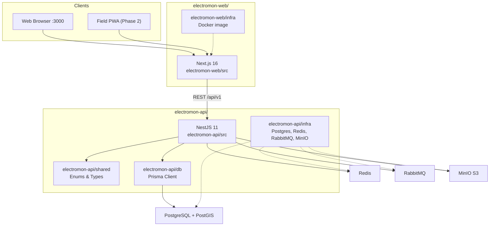
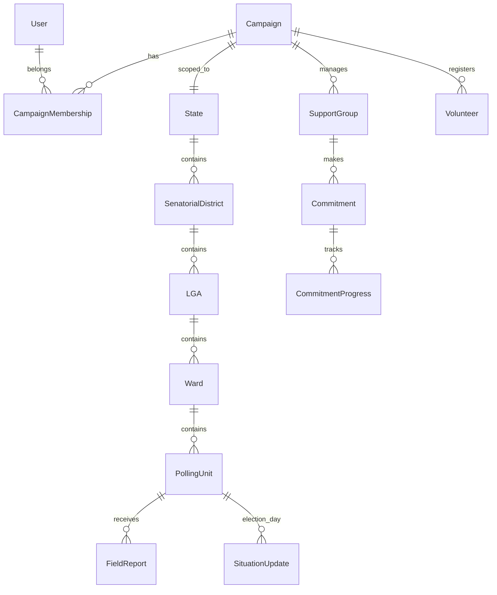
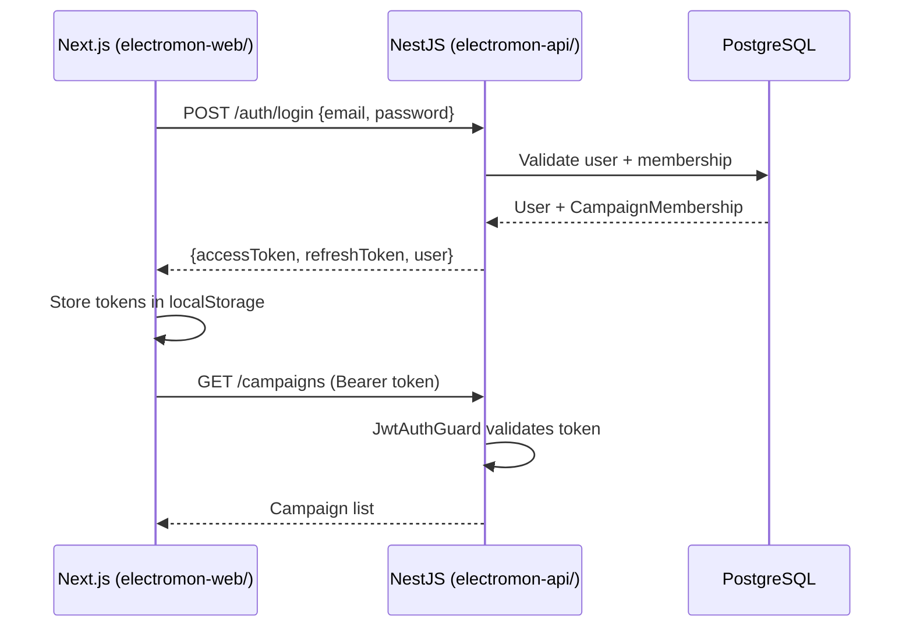

# Electromon Architecture

## Overview

Electromon is split into **two independent Git repos** that communicate over HTTP:

- **This repo** — NestJS 11 backend, Prisma, PostgreSQL, with `db/` and `shared/` as local packages
- **[electromon-web](https://github.com/ibrex29/electromon-web)** — Next.js 16 dashboard (REST client only; no shared npm packages)

Nationwide + backend-scaling deliberation (print/PDF): web repo [`docs/architecture-review.html`](https://github.com/ibrex29/electromon-web/blob/dev/docs/architecture-review.html) (Architecture Review v2.0). Visual target sketches: [`docs/presidential-architecture.html`](https://github.com/ibrex29/electromon-web/blob/dev/docs/presidential-architecture.html).

Each project has its own **`infra/`** folder for Docker Compose and deployment.



## Repository layout

Two **independent Git repos** (not a monorepo):

**This repo (electromon-api):**

```
├── src/                  NestJS modules
├── db/                   Prisma schema, migrations, seed
├── shared/               Enums & types (API-only)
├── test/                 Unit + e2e tests
├── docs/                 Architecture, API reference
├── infra/                Docker Compose, observability
├── Makefile
└── package.json
```

**Web repo:** [github.com/ibrex29/electromon-web](https://github.com/ibrex29/electromon-web) — Next.js dashboard, own `infra/` and `Makefile`.

There is **no pnpm workspace** and **no shared root**. Install and run commands inside each repo separately.

## Module map (MVP)

| # | Module | API path | Web route | Status |
|---|--------|----------|-----------|--------|
| 1 | Authentication & RBAC | `modules/auth` | `/login` | ✅ |
| 2 | Campaign Structure | `modules/structure` | `/dashboard/structure` | ✅ API / partial UI |
| 3 | Support Groups | `modules/support-groups` | `/dashboard/support-groups` | ✅ |
| 4 | Commitments & Targets | `modules/commitments` | `/dashboard/commitments` | ✅ |
| 5 | Volunteer Management | `modules/volunteers` | `/dashboard/volunteers` | ✅ |
| 6 | Field Reporting | `modules/field-reports` | — | ✅ API |
| 7 | Polling Unit Intelligence | `modules/polling-units` | `/dashboard/polling-units` | ✅ |
| 8 | Election Day Situation Room | `modules/situation-room` | `/dashboard/situation-room` | ✅ |
| 9 | Analytics Dashboard | `modules/analytics` | `/dashboard/analytics` | ✅ |

## Data model



## Authentication flow



## RBAC design

- Roles are **campaign-scoped** via `CampaignMembership`
- Each membership has optional `scopeType` + `scopeId` for geographic isolation
- `@Roles('CAMPAIGN_DIRECTOR')` decorator + `RolesGuard` enforce role checks on mutating routes
- Scope-based row filtering applied in service layer per module

## Database package (`db/`)

NestJS consumes `@electromon/db` as a **local file dependency** (`file:./db` in `electromon-api/package.json`):

```
db/
├── prisma/schema.prisma      Schema definition
├── prisma/migrations/        Applied migrations
├── prisma.config.ts          Prisma 7 config (URL, migrations, seed)
├── src/
│   ├── index.ts              Re-exports Prisma client + adapter
│   └── client.ts             createPgAdapter() helper
└── dist/                     Compiled CommonJS (gitignored)
```

The API dev script builds `shared/` and `db/` before starting NestJS:

```bash
pnpm dev
# runs: prisma generate → shared build → db build → nest start --watch
```

## Shared types (`shared/`)

TypeScript enums and interfaces used by the API. The web app **duplicates** relevant enums locally in `web repo: src/lib/*.ts` and talks to the API over HTTP — there is no shared npm package between projects.

## Infrastructure

### API (`infra/`)

| Service | Purpose |
|---------|---------|
| PostgreSQL + PostGIS | Primary database |
| Redis | Cache, sessions, rate-limit backing |
| RabbitMQ | Async jobs (consumers pending) |
| MinIO | S3-compatible object storage |
| Prometheus / Grafana / Loki | Observability (`make infra-obs-up`) |

Local dev (deps only, API on host):

```bash
make infra-up && make dev
```

Full stack in Docker:

```bash
make infra-full
```

### Web ([electromon-web](https://github.com/ibrex29/electromon-web))

Docker image and compose for the Next.js standalone server — run from the **web repo**:

```bash
make infra-up
```

Set `NEXT_PUBLIC_API_URL` before building — it is baked in at build time.

## Deployment

Deploy **API and web as separate repos**:

| Environment | API (this repo) | Web repo |
|-------------|-----------------|----------|
| Staging | `make infra-staging-up` | `make infra-staging-up` |
| Production | `make infra-prod-up` | `make infra-prod-up` |
| Managed DB + S3 | `make infra-prod-external-up` | — |

Production target: **DigitalOcean** (managed Postgres, Spaces, Docker containers).

## Observability

| Feature | Location |
|---------|----------|
| Structured JSON logs | Pino via `nestjs-pino`; `X-Request-Id` header |
| Liveness | `GET /api/v1/health/live` |
| Readiness | `GET /api/v1/health/ready` |
| Prometheus metrics | `GET /api/v1/metrics` |
| Audit trail | `ActivityLog` on login + mutating requests |

Grafana dashboard: **Electromon — Election Day** (see `infra/observability/`).
